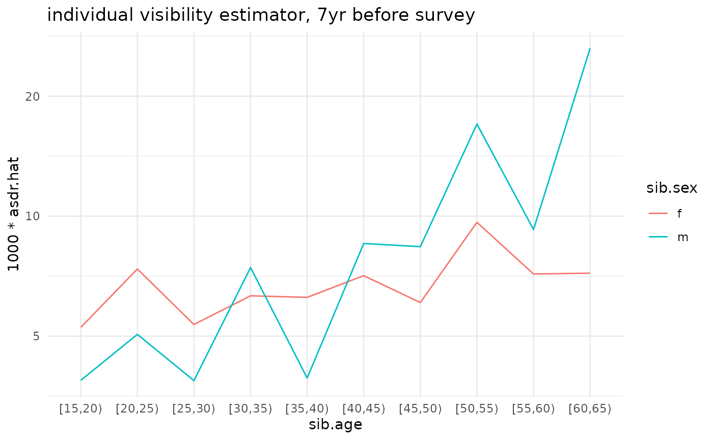
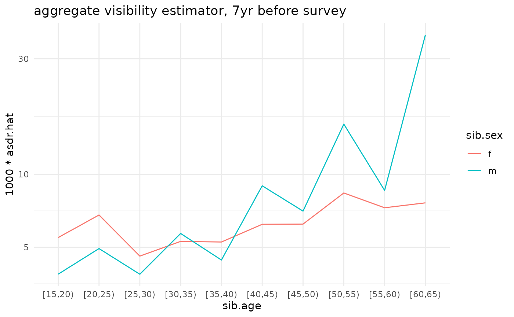
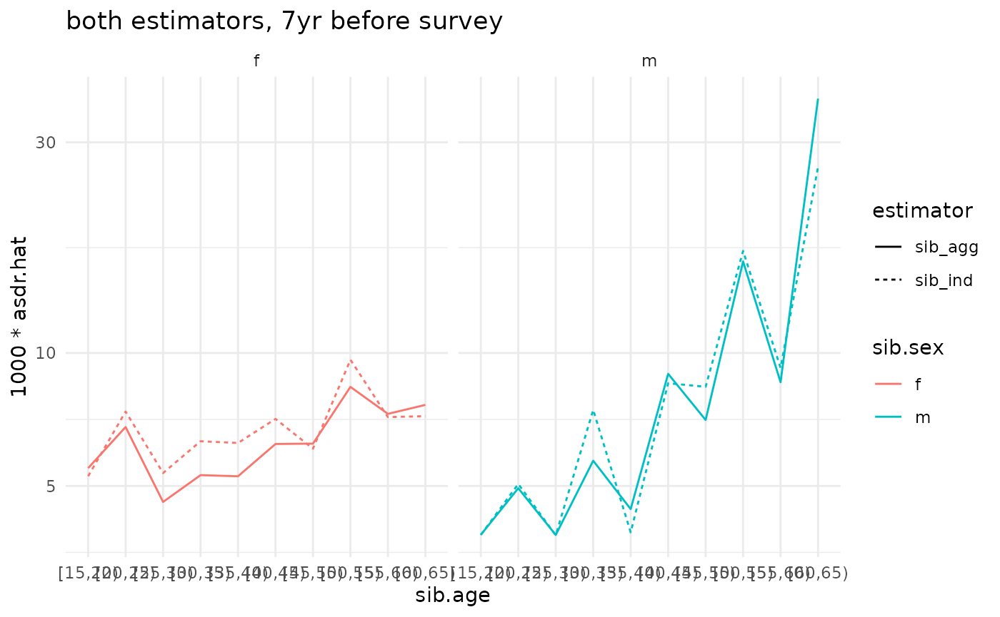
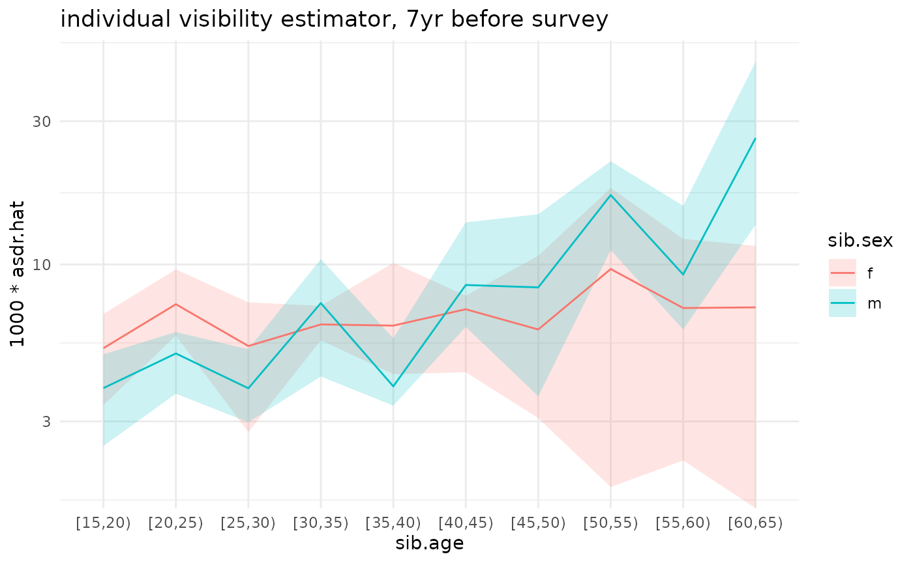
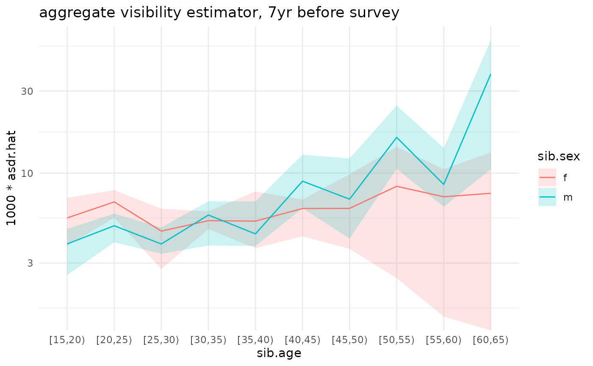
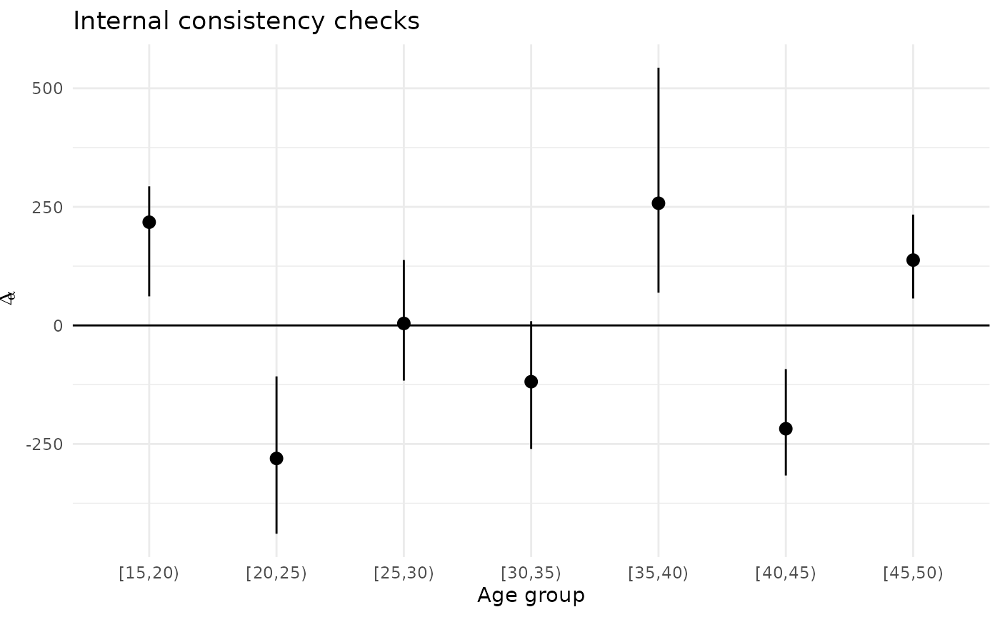
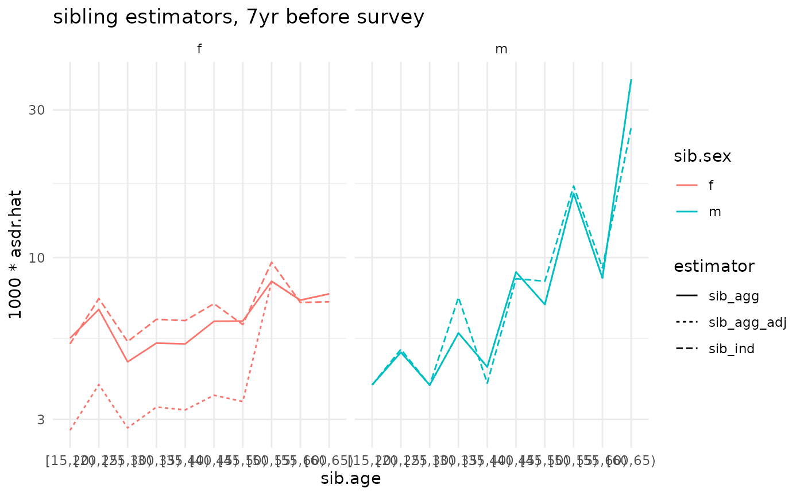

# Estimating death rates from sibling history data

``` r
library(siblingsurvival)
library(tidyverse)
#> ── Attaching core tidyverse packages ──────────────────────── tidyverse 2.0.0 ──
#> ✔ dplyr     1.2.0     ✔ readr     2.2.0
#> ✔ forcats   1.0.1     ✔ stringr   1.6.0
#> ✔ ggplot2   4.0.2     ✔ tibble    3.3.1
#> ✔ lubridate 1.9.5     ✔ tidyr     1.3.2
#> ✔ purrr     1.2.1     
#> ── Conflicts ────────────────────────────────────────── tidyverse_conflicts() ──
#> ✖ dplyr::filter() masks stats::filter()
#> ✖ dplyr::lag()    masks stats::lag()
#> ℹ Use the conflicted package (<http://conflicted.r-lib.org/>) to force all conflicts to become errors
# be sure you have at least version 0.0.2.9000 of surveybootstrap
# run devtools::install_github('dfeehan/surveybootstrap')
# for the most recent version
library(surveybootstrap)  

# this is helfpul for timing
library(tictoc)
```

## Overview

It will be helpful to define a few important terms before we start our
analysis:

- `ego` - an ego is a survey respondent
- `cell` - a cell is a generic group for which we wish to produce
  estimates. Usually, a cell is defined by a time period, an age range,
  and a sex. So, for example, a cell might be women who were age 30-34
  in 2015.

For the purposes of this vignette, we’ll assume that we starting from
two datasets:

- one dataset has a row for each survey respondent
- one dataset has a row for each sibling who is reported by a survey
  respondent

We’ll then calculate estimates from the sibling histories in three main
steps:

1.  Create an **esc** dataset, so called because there is row for each
    **e**go X **s**ibling X **c**ell
2.  Aggregate this esc dataset up into an **ec** dataset, which has a
    row for the reports made by each ego for each cell
3.  Aggregate this ec dataset up into estimates for death rates, using
    either the individual or aggregate visibility approach (or both)

### Opening up the demo datasets

We’ll start by opening up the demonstration DHS dataset.

``` r
data(model_dhs_dat)
```

Now we’ll use `prep_dhs_sib_histories` to ready the sibling histories
for analysis. (Please see the [Preparing
Data](http://dennisfeehan.org/siblingsurvival/articles/preparing-data.md)
vignette for more details.)

``` r
prepped <- prep_dhs_sib_histories(model_dhs_dat,
                                  varmap = sibhist_varmap_dhs6,
                                  keep_missing = FALSE)
#> 
#> No information on respondent sex given; assuming all respondents are female.
#> 
#> Found wwgt column; assuming we have a DHS survey and scaling weights.
#> 638 out of 35082 (1.82%) reports about sibs have unknown survival status.
#> 602 out of 35082 (1.72%) reports about sibs have unknown sex.
#> Removing reported sibs missing survival status or sex.
#> ... this removes  642  out of  35082  ( 1.83 %)  sibling reports.

# we'll only keep the variable we will need for this analysis
ex.ego <- prepped$ego.dat %>%
  ## add a 'sex' variable
  mutate(sex = 'f') %>%
  select(caseid, 
         psu, 
         stratum_analysis, 
         stratum_design, 
         cluster, 
         age.cat, sex, wwgt)
ex.sib <- prepped$sib.dat
```

Let’s take a look at the datasets we’ve produced. First, here’s a
dataset that has information about survey respondents. (We’ll refer to
these survey respondents as ‘ego’):

``` r
glimpse(ex.ego)
#> Rows: 8,348
#> Columns: 8
#> $ caseid           <chr> "        1  1  2", "        1  3  2", "        1  4  …
#> $ psu              <dbl> 1, 1, 1, 1, 1, 1, 1, 1, 1, 1, 1, 1, 1, 1, 1, 1, 1, 1,…
#> $ stratum_analysis <dbl> 26, 26, 26, 26, 26, 26, 26, 26, 26, 26, 26, 26, 26, 2…
#> $ stratum_design   <dbl> 4, 4, 4, 4, 4, 4, 4, 4, 4, 4, 4, 4, 4, 4, 4, 4, 4, 4,…
#> $ cluster          <dbl> 1, 1, 1, 1, 1, 1, 1, 1, 1, 1, 1, 1, 1, 1, 1, 1, 1, 1,…
#> $ age.cat          <fct> "[30,35)", "[20,25)", "[40,45)", "[25,30)", "[25,30)"…
#> $ sex              <chr> "f", "f", "f", "f", "f", "f", "f", "f", "f", "f", "f"…
#> $ wwgt             <dbl> 1.057703, 1.057703, 1.057703, 1.057703, 1.057703, 1.0…
```

And here’s a long-form version of the sibling history data – there’s one
row for each reported sibling.

``` r
glimpse(ex.sib)
#> Rows: 34,440
#> Columns: 25
#> $ .tmpid                  <chr> "        1  1  2", "        1  3  2", "       …
#> $ caseid                  <chr> "        1  1  2", "        1  3  2", "       …
#> $ wwgt                    <dbl> 1.057703, 1.057703, 1.057703, 1.057703, 1.0577…
#> $ psu                     <dbl> 1, 1, 1, 1, 1, 1, 1, 1, 1, 1, 1, 1, 1, 1, 1, 1…
#> $ doi                     <dbl> 1386, 1386, 1386, 1386, 1386, 1386, 1386, 1386…
#> $ sex                     <chr> "f", "f", "f", "f", "f", "f", "f", "f", "f", "…
#> $ sibindex                <dbl> 1, 1, 1, 1, 1, 1, 1, 1, 1, 1, 1, 1, 1, 1, 1, 1…
#> $ sib.sex                 <chr> "m", "f", "m", "f", "m", "f", "m", "f", "m", "…
#> $ sib.alive               <dbl> 1, 1, 1, 1, 1, 1, 1, 1, 1, 1, 1, 0, 0, 1, 1, 1…
#> $ sib.age                 <dbl> 42, 27, 46, 33, 40, 49, 22, 30, 49, 50, 35, NA…
#> $ sib.dob                 <dbl> 876, 1056, 828, 984, 900, 792, 1116, 1020, 792…
#> $ sib.marital.status      <dbl> NA, NA, NA, NA, NA, NA, NA, NA, NA, NA, NA, NA…
#> $ sib.death.yrsago        <dbl> NA, NA, NA, NA, NA, NA, NA, NA, NA, NA, NA, 3,…
#> $ sib.death.age           <dbl> NA, NA, NA, NA, NA, NA, NA, NA, NA, NA, NA, 42…
#> $ sib.death.date          <dbl> -1, -1, -1, -1, -1, -1, -1, -1, -1, -1, -1, 13…
#> $ sib.died.pregnant       <dbl> NA, NA, NA, NA, NA, NA, NA, NA, NA, NA, NA, NA…
#> $ sib.died.bc.pregnancy   <dbl> NA, NA, NA, NA, NA, NA, NA, NA, NA, NA, NA, NA…
#> $ sib.death.cause         <dbl> NA, NA, NA, NA, NA, NA, NA, NA, NA, NA, NA, NA…
#> $ sib.time.delivery.death <dbl> NA, NA, NA, NA, NA, NA, NA, NA, NA, NA, NA, NA…
#> $ sib.place.death         <dbl> NA, NA, NA, NA, NA, NA, NA, NA, NA, NA, NA, NA…
#> $ sib.num.children        <dbl> NA, NA, NA, NA, NA, NA, NA, NA, NA, NA, NA, NA…
#> $ sib.death.year          <dbl> NA, NA, NA, NA, NA, NA, NA, NA, NA, NA, NA, NA…
#> $ alternum                <chr> "01", "01", "01", "01", "01", "01", "01", "01"…
#> $ sib.endobs              <dbl> 1386, 1386, 1386, 1386, 1386, 1386, 1386, 1386…
#> $ sibid                   <int> 1, 2, 3, 4, 5, 6, 7, 8, 9, 10, 11, 12, 13, 14,…
```

### Laying the groundwork

First, we’ll need to add an indicator variable for each sibling’s frame
population membership. In other words, we need to create a variable that
has the value 1 for each sibling who was eligible to respond to the
survey, and 0 otherwise. In this example data, we’ll assume that
conditions similar to a typical DHS survey hold: i.e., we’ll assume the
survey design was such that siblings would have been eligible to respond
if they

- are alive
- are female
- are between the ages of 15 and 50

For a given survey, these criteria will differ. You’ll have to find out
what the criteria for inclusion in the frame population were in order to
produce estimates from sibling histories.

``` r
ex.sib <- ex.sib %>% 
  mutate(in.F = as.numeric((sib.alive==1) & (sib.age >= 15) & (sib.age <= 49) & (sib.sex == 'f')))
```

Let’s look at the distribution of frame population membership

``` r
with(ex.sib, table(in.F, useNA='ifany'))
#> in.F
#>     0     1  <NA> 
#> 22826 11513   101
```

In this example dataset, a small number of the `in.F` values is missing.
(In a real dataset, there could well be more.) Since we need to be able
to determine whether or not each sibling is on in the frame population,
we would drop siblings missing `in.F` values from the analysis.

``` r
ex.sib <- ex.sib %>% filter(! is.na(in.F)) 
```

### Specifying cells

When we produce estimated death rates from sibling histories, we usually
do so for different sex X age group X time period combinations. These
are called *cells*.

Our next step is to create an object that describes the cells that we
plan to produce death rate estimates for. This means we need to specify
the time period and age groups that we’ll be using. We’ll use the helper
function `cell_config` to do this:

``` r
cc <- cell_config(age.groups='5yr', 
                  time.periods='7yr_beforeinterview',
                  start.obs='sib.dob',    # date of birth
                  end.obs='sib.endobs',   # either the date respondent was interviewed (if sib is alive) or date of death (if sib is dead)
                  event='sib.death.date', # date of death (for sibs who died)
                  age.offset='sib.dob',   # date of birth
                  time.offset='doi',      # date of interview
                  exp.scale=1/12)
```

We’re specifying that we want

- 5-year age groups, starting from 15 and ending at 65
- to produce estimates for the 7-year window before each survey
  interview (so, slightly different for each respondent)
- the `dob` column of our sibling dataset has the time siblings start
  being observed (their birthdate)
- the `endobs` column of our sibling dataset has the time siblings stop
  being observed (the interview or, if they’re dead, the date of death)
- the `death.date` column of our sibling dataset has the date the
  sibling died (if the sibling died)
- the `doi` column of our sibling dataset has the date the respondent
  who reported about the sibling was interviewed
- in our survey, times are counted in months, so we set `exp.scale=1/12`
  to indicate that we need to divide total exposures by 12 to get years

### Estimating death rates

Given these preparatory steps, the `sibling_estimator` function will
take care of estimating death rates from the sibling histories for us.

``` r
ex_ests <- sibling_estimator(sib.dat = ex.sib,
                             ego.id = 'caseid',            # column with the respondent id
                             sib.id = 'sibid',             # column with sibling id 
                                                           # (unique for each reported sibling)
                             sib.frame.indicator = 'in.F', # indicator for sibling frame population membership
                             sib.sex = 'sib.sex',          # column with sibling's sex
                             cell.config=cc,               # cell configuration we created above
                             weights='wwgt')               # column with the respondents' sampling weights

names(ex_ests)
#> [1] "asdr.ind" "asdr.agg" "ec.dat"   "esc.dat"
```

`sibling_estimator` returns a list with the results. We’ll focus on
`asdr.ind`, which has the individual visibility estimates, and
`asdr.agg`, which has the aggregate visibility estimates.

Here are the individual visibility estimates:

``` r
glimpse(ex_ests$asdr.ind)
#> Rows: 20
#> Columns: 10
#> $ time.period <chr> "7yr_beforeint", "7yr_beforeint", "7yr_beforeint", "7yr_be…
#> $ sib.sex     <chr> "f", "f", "f", "f", "f", "f", "f", "f", "f", "f", "m", "m"…
#> $ sib.age     <chr> "[15,20)", "[20,25)", "[25,30)", "[30,35)", "[35,40)", "[4…
#> $ num.hat     <dbl> 40.632794, 58.452102, 37.335533, 35.027380, 27.127385, 19.…
#> $ denom.hat   <dbl> 7724.0549, 7931.6173, 6980.3260, 5548.5989, 4336.3677, 274…
#> $ ind.y.F     <dbl> 11400.964, 11400.964, 11400.964, 11400.964, 11400.964, 114…
#> $ n           <int> 6864, 6864, 6864, 6864, 6864, 6864, 6864, 6864, 6864, 6864…
#> $ wgt.sum     <dbl> 6798.047, 6798.047, 6798.047, 6798.047, 6798.047, 6798.047…
#> $ asdr.hat    <dbl> 0.005260552, 0.007369506, 0.005348680, 0.006312833, 0.0062…
#> $ estimator   <chr> "sib_ind", "sib_ind", "sib_ind", "sib_ind", "sib_ind", "si…
```

And here are the aggregate visibility estimates

``` r
glimpse(ex_ests$asdr.agg)
#> Rows: 20
#> Columns: 9
#> $ time.period <chr> "7yr_beforeint", "7yr_beforeint", "7yr_beforeint", "7yr_be…
#> $ sib.sex     <chr> "f", "f", "f", "f", "f", "f", "f", "f", "f", "f", "m", "m"…
#> $ sib.age     <chr> "[15,20)", "[20,25)", "[25,30)", "[30,35)", "[35,40)", "[4…
#> $ num.hat     <dbl> 80.640472, 108.425029, 66.546631, 61.344200, 46.548261, 33…
#> $ denom.hat   <dbl> 14696.0833, 15949.0545, 14466.8583, 11597.0465, 8851.6251,…
#> $ n           <int> 6864, 6864, 6864, 6864, 6864, 6864, 6864, 6864, 6864, 6864…
#> $ wgt.sum     <dbl> 6798.047, 6798.047, 6798.047, 6798.047, 6798.047, 6798.047…
#> $ asdr.hat    <dbl> 0.005487208, 0.006798210, 0.004599937, 0.005289640, 0.0052…
#> $ estimator   <chr> "sib_agg", "sib_agg", "sib_agg", "sib_agg", "sib_agg", "si…
```

### Plotting the results

We’ll make some plots showing the results

``` r
ggplot(ex_ests$asdr.ind) +
  geom_line(aes(x=sib.age, y=1000*asdr.hat, color=sib.sex, group=sib.sex)) +
  theme_minimal() +
  scale_y_log10() + 
  ggtitle('individual visibility estimator, 7yr before survey')
```



``` r
ggplot(ex_ests$asdr.agg) +
  geom_line(aes(x=sib.age, y=1000*asdr.hat, color=sib.sex, group=sib.sex)) +
  theme_minimal() +
  scale_y_log10() + 
  ggtitle('aggregate visibility estimator, 7yr before survey')
```



``` r
compare <- bind_rows(ex_ests$asdr.ind, ex_ests$asdr.agg)

ggplot(compare) +
  geom_line(aes(x=sib.age, y=1000*asdr.hat, color=sib.sex, linetype=estimator, group=interaction(estimator, sib.sex))) +
  theme_minimal() +
  #facet_grid(sex ~ .) +
  facet_grid(. ~ sib.sex) +
  scale_y_log10() + 
  ggtitle('both estimators, 7yr before survey')
```



## Variance estimates

In practice, we want point estimates and estimated sampling uncertainty
for the death rates. We’ll use the rescaled bootstrap to estimate
sampling uncertainty. This can be done with the `surveybootstrap`
package.

Before we use the rescaled bootstrap, we need to know a little bit about
the sampling design of the survey we’re working with. In this example
dataset, we have a stratified, multistage design. So we’ll need to tell
the bootstrap function about the strata and the primary sampling units.
In this example data, these are indicated by the ‘stratum’ and ‘psu’
columns of the dataset.

(NOTE: this takes about a minute or so on a 2018 MBP for 1000
resamples.)

``` r
set.seed(101010)

tic('running bootstrap')
## this will take a little while -- for 1000 reps, it takes about 10 minutes on a 2018 Macbook Pro
#num.boot.reps <- 1000
# reduce number of reps to help vignette build faster
num.boot.reps <- 100


# The Guide to DHS Statistics DHS-8
# suggests using what we call the `stratum_design` variable
# (v023) in calculating sampling-based standard errors
bootweights <- surveybootstrap::rescaled.bootstrap.weights(survey.design = ~ psu + strata(stratum_design),
                                                           # a high number is good here, though that will obviously
                                                           # make everything take longer
                                                           num.reps=num.boot.reps,
                                                           idvar='caseid',       # column with the respondent ids
                                                           weights='wwgt', # column with the sampling weight
                                                           survey.data=ex.ego    # note that we pass in the respondent data, NOT the sibling data
                                                           )
#> Warning: Unquoting language objects with `!!!` is deprecated as of rlang 0.4.0. Please
#> use `!!` instead.
#> 
#> # Bad: dplyr::select(data, !!!enquo(x))
#> 
#> # Good: dplyr::select(data, !!enquo(x)) # Unquote single quosure
#> dplyr::select(data, !!!enquos(x)) # Splice list of quosures
#> This warning is displayed once every 8 hours.
toc()
#> running bootstrap: 0.711 sec elapsed
```

The result, `bootweights`, is a dataframe that has a row for each survey
respondent, a column for the survey respondent’s ID, and then
`num.boot.reps` columns containing survey weights that result from the
bootstrap procedure. The basic idea is to calculate estimated death
rates using each one of the `num.boot.reps` sets of weights. The
variation across the estimates is then an estimator for the sampling
variation.

To make this easier, the `sibling_estimator` function can take a dataset
with bootstrap resampled weights; it will then calculate and summarize
the estimates for you.

(NOTE: this is slow; it takes about 35 minutes or so on a 2018 MBP when
`bootweights` has 1000 resamples.)

``` r
# to save time, we'll only use a subset of the bootstrap replicates

short.bootweights <- bootweights %>% select(1:11)

#est.bootweights <- bootweights
est.bootweights <- short.bootweights

tic('calculating estimates with bootstrap')
ex_boot_ests <- sibling_estimator(sib.dat = ex.sib,
                                  ego.id = 'caseid',
                                  sib.id = 'sibid',
                                  sib.frame.indicator = 'in.F',
                                  sib.sex = 'sib.sex',
                                  cell.config=cc,
                                  boot.weights=est.bootweights,  # to get sampling uncertainty, we pass boot.weights into sibling_estimator
                                  return.boot=TRUE,                # when TRUE, return all of the resampled estimates (not just summaries)
                                  weights='wwgt')
toc()
#> calculating estimates with bootstrap: 9.197 sec elapsed
```

Finally, let’s plot the estimated death rates along with their sampling
uncertainty:

``` r
ggplot(ex_boot_ests$asdr.ind) +
  geom_ribbon(aes(x=sib.age, ymin=1000*asdr.hat.ci.low, ymax=1000*asdr.hat.ci.high, fill=sib.sex, group=sib.sex), alpha=.2) +
  geom_line(aes(x=sib.age, y=1000*asdr.hat, color=sib.sex, group=sib.sex)) +
  theme_minimal() +
  scale_y_log10() + 
  ggtitle('individual visibility estimator, 7yr before survey')
#> Warning in scale_y_log10(): log-10 transformation introduced
#> infinite values.
```



``` r
ggplot(ex_boot_ests$asdr.agg) +
  geom_ribbon(aes(x=sib.age, ymin=1000*asdr.hat.ci.low, ymax=1000*asdr.hat.ci.high, fill=sib.sex, group=sib.sex), alpha=.2) +
  geom_line(aes(x=sib.age, y=1000*asdr.hat, color=sib.sex, group=sib.sex)) +
  theme_minimal() +
  scale_y_log10() + 
  ggtitle('aggregate visibility estimator, 7yr before survey')
#> Warning in scale_y_log10(): log-10 transformation introduced
#> infinite values.
```



## Internal consistency checks

In this section, we illustrate how to conduct internal consistency
checks:

NOTE: The IC checks can take a while – about 36 minutes for 1000
bootstrap reps on a 2018 MBP

``` r
# toggle between short bootweights (faster, for coding) and long bootweights (for realism)
ic.bootweights <- short.bootweights
#ic.bootweights <- bootweights

tic("Internal consistency checks")
ic.checks <- sib_ic_checks(ex_boot_ests$esc.dat,
                           ego.dat=ex.ego,
                           ego.id='caseid',
                           sib.id='sibid',
                           sib.frame.indicator='in.F',
                           sib.cell.vars=c('sib.age', 'sib.sex'),
                           ego.cell.vars=c('age.cat', 'sex'),
                           boot.weights=ic.bootweights)
toc()
#> Internal consistency checks: 0.677 sec elapsed

names(ic.checks)
#> [1] "ic.summ"      "ic.boot.ests"
```

We can look at `ic.checks$ic.summ`, which has summarized output:

``` r
glimpse(ic.checks$ic.summ)
#> Rows: 7
#> Columns: 27
#> $ cell                        <chr> "[15,20)_X_f", "[20,25)_X_f", "[25,30)_X_f…
#> $ age.cat                     <chr> "[15,20)", "[20,25)", "[25,30)", "[30,35)"…
#> $ sex                         <chr> "f", "f", "f", "f", "f", "f", "f"
#> $ diff_mean                   <dbl> 217.681488, -280.571617, 4.100908, -118.68…
#> $ diff_se                     <dbl> 79.80164, 103.48449, 92.09746, 90.32214, 1…
#> $ diff_ci_low                 <dbl> 61.31572, -439.30176, -116.38523, -260.483…
#> $ diff_ci_high                <dbl> 293.215050, -107.512966, 137.894372, 8.833…
#> $ abs_diff_mean               <dbl> 217.68149, 280.57162, 77.89882, 122.88106,…
#> $ abs_diff_se                 <dbl> 79.80164, 103.48449, 41.93034, 83.85326, 1…
#> $ abs_diff_ci_low             <dbl> 61.31572, 107.51297, 14.76047, 23.69984, 6…
#> $ abs_diff_ci_high            <dbl> 293.2151, 439.3018, 144.3283, 260.4840, 54…
#> $ diff2_mean                  <dbl> 53116.701, 88358.567, 7650.565, 21427.988,…
#> $ diff2_se                    <dbl> 28519.506, 57939.806, 6922.625, 24670.378,…
#> $ diff2_ci_low                <dbl> 5646.2832, 13768.2134, 289.0865, 586.9915,…
#> $ diff2_ci_high               <dbl> 85983.26, 195463.36, 20965.82, 68297.22, 2…
#> $ normalized_diff_mean        <dbl> 1.125949e-05, -1.545307e-05, 2.160616e-07,…
#> $ normalized_diff_se          <dbl> 4.372164e-06, 6.935741e-06, 4.343266e-06, …
#> $ normalized_diff_ci_low      <dbl> 3.005497e-06, -2.687438e-05, -5.311261e-06…
#> $ normalized_diff_ci_high     <dbl> 1.577190e-05, -5.253123e-06, 6.412978e-06,…
#> $ abs_normalized_diff_mean    <dbl> 1.125949e-05, 1.545307e-05, 3.693324e-06, …
#> $ abs_normalized_diff_se      <dbl> 4.372164e-06, 6.935741e-06, 1.938959e-06, …
#> $ abs_normalized_diff_ci_low  <dbl> 3.005497e-06, 5.253123e-06, 6.635886e-07, …
#> $ abs_normalized_diff_ci_high <dbl> 1.577190e-05, 2.687438e-05, 6.551828e-06, …
#> $ normalized_diff2_mean       <dbl> 1.439804e-10, 2.820916e-10, 1.702425e-11, …
#> $ normalized_diff2_se         <dbl> 8.313410e-11, 2.319066e-10, 1.440957e-11, …
#> $ normalized_diff2_ci_low     <dbl> 1.420808e-11, 3.354854e-11, 6.805513e-13, …
#> $ normalized_diff2_ci_high    <dbl> 2.488334e-10, 7.340667e-10, 4.324025e-11, …
```

It’s often helpful to plot the results of the internal consistency
checks:

``` r
ggplot(ic.checks$ic.summ) +
  geom_hline(yintercept=0) +
  geom_pointrange(aes(x=age.cat,
                      y=diff_mean,
                      ymin=diff_ci_low,
                      ymax=diff_ci_high)) +
  theme_minimal() +
  ggtitle("Internal consistency checks") +
  xlab("Age group") +
  ylab(expression(Delta[alpha]))
```



``` r

#ggplot(ic.checks$ic.summ) +
#  geom_hline(yintercept=0) +
#  geom_pointrange(aes(x=age.cat,
#                      y=agg_diff_mean,
#                      ymin=agg_diff_ci_low,
#                      ymax=agg_diff_ci_high)) +
#  theme_minimal() +
#  ggtitle("Internal consistency checks (aggregate)") +
#  xlab("Age group") +
#  ylab(expression(Delta[alpha]))
#
#ggplot(ic.checks$ic.summ) +
#  geom_hline(yintercept=0) +
#  geom_pointrange(aes(x=age.cat,
#                      y=ind_diff_mean,
#                      ymin=ind_diff_ci_low,
#                      ymax=ind_diff_ci_high)) +
#  theme_minimal() +
#  ggtitle("Internal consistency checks (individual)") +
#  xlab("Age group") +
#  ylab(expression(Delta[alpha]))
```

## Visibilities

``` r
sib.F.dat <- ex.sib %>%
  group_by(caseid) %>%
  summarize(y.F = sum(in.F))

ego.vis <- ex.ego %>% 
  select(caseid, wwgt, age.cat, sex) %>%
  left_join(sib.F.dat, by='caseid')

# if nothing was joined in, there are no sibs
ego.vis <- ego.vis %>%
  mutate(y.F=ifelse(is.na(y.F), 0, y.F))

ego.vis.agg <- ego.vis %>%
  group_by(sex, age.cat) %>%
  summarise(y.F.bar = weighted.mean(y.F, wwgt)) %>%
  mutate(adj.factor = y.F.bar / (y.F.bar + 1))
#> `summarise()` has regrouped the output.
#> ℹ Summaries were computed grouped by sex and age.cat.
#> ℹ Output is grouped by sex.
#> ℹ Use `summarise(.groups = "drop_last")` to silence this message.
#> ℹ Use `summarise(.by = c(sex, age.cat))` for per-operation grouping
#>   (`?dplyr::dplyr_by`) instead.
```

Make adjusted individual estimates

``` r
adj.agg.ests <- ex_ests$asdr.agg %>%
  left_join(ego.vis.agg,
            by=c('sib.sex'='sex', 'sib.age'='age.cat')) %>%
  mutate(adj.factor = ifelse(is.na(adj.factor), 1, adj.factor),
         estimator = 'sib_agg_adj',
         asdr.hat = asdr.hat * adj.factor)
```

And plot a comparison

``` r
compare <- bind_rows(ex_ests$asdr.ind, ex_ests$asdr.agg, adj.agg.ests)

ggplot(compare) +
  geom_line(aes(x=sib.age, y=1000*asdr.hat, color=sib.sex, linetype=estimator, group=interaction(estimator, sib.sex))) +
  theme_minimal() +
  #facet_grid(sex ~ .) +
  facet_grid(. ~ sib.sex) +
  scale_y_log10() + 
  ggtitle('sibling estimators, 7yr before survey')
```


